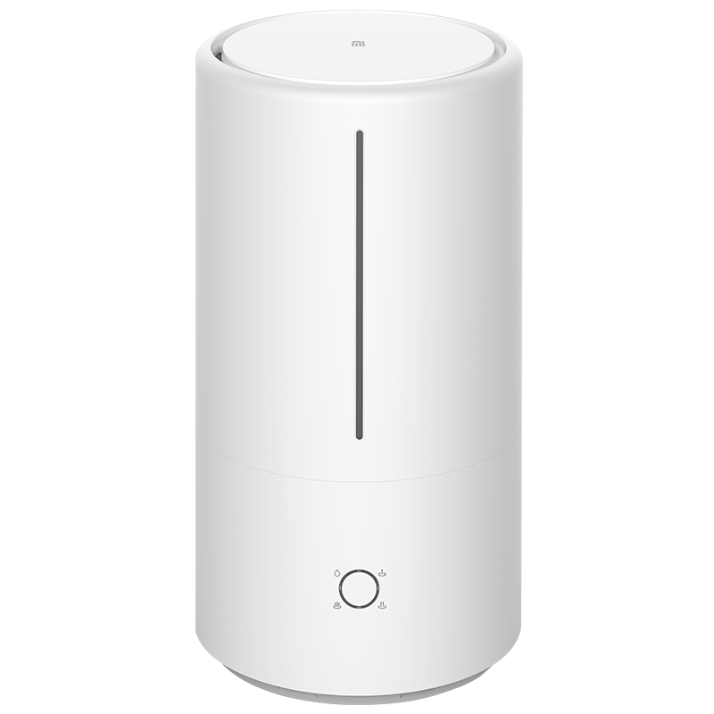
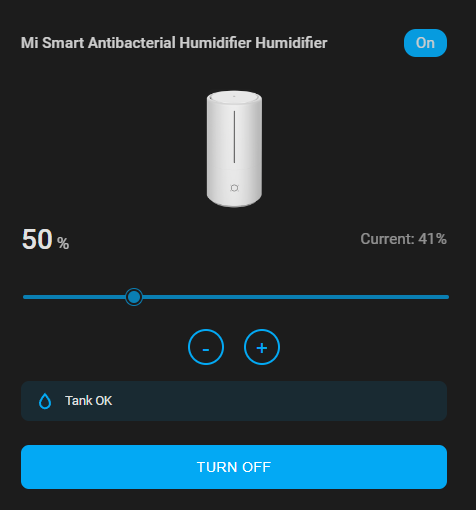

# Mi Humidifier Card

A custom card for Home Assistant that provides a beautiful interface to control Xiaomi Mi Humidifier devices.

## Screenshots

### Device View
<p align="center">
  
</p>

### Card View
<p align="center">
  
</p>

## Features

- 🎯 Target humidity control with slider and +/- buttons
- 💧 Water level monitoring with status indicator
- ⚡ Power control with loading states
- 🎨 Modern, responsive design
- 🌙 Dark theme support
- 🔄 Real-time status updates

## Installation

### HACS (Recommended)

1. Open HACS in your Home Assistant instance
2. Go to "Frontend" section
3. Click the menu icon in the top right and select "Custom repositories"
4. Add this repository URL with category "Lovelace"
5. Install "Mi Humidifier Card"
6. Refresh your browser

### Manual Installation

1. Download `ha-mi-humidifier-card.js` from the latest release
2. Copy it to your `config/www` folder
3. Add the resource in your dashboard:
   ```yaml
   resources:
     - url: /local/ha-mi-humidifier-card.js
       type: module
   ```
4. Refresh your browser

## Configuration

Add the card to your dashboard with this configuration:

```yaml
type: custom:ha-mi-humidifier-card
entity: humidifier.your_mi_humidifier_entity
```

### Options

| Name | Type | Default | Description |
|------|------|---------|-------------|
| entity | string | **Required** | Your Mi Humidifier entity ID |

## Development

### Prerequisites

- [Node.js](https://nodejs.org) (v14 or later)
- [Home Assistant](https://www.home-assistant.io/) instance

### Setup

1. Clone this repository
2. Install dependencies:
   ```bash
   npm install
   ```
3. Start development server:
   ```bash
   npm start
   ```
4. The card will be served at `http://localhost:5000/ha-mi-humidifier-card.js`

### Building

```bash
npm run build
```

Built files will be in the `dist` folder.

### Testing

The project uses Jest for unit testing. Tests are written in TypeScript and located in `src/*.test.ts` files.

To run tests:
```bash
npm test
```

To run tests in watch mode:
```bash
npm run test:watch
```

Current test coverage includes:
- Configuration validation
- Target humidity control
- State management
- Error handling

## Contributing

Contributions are welcome! Please feel free to submit a Pull Request.

Before submitting:
1. Make sure all tests pass
2. Add tests for new features
3. Follow the existing code style
4. Update documentation as needed

## License

This project is under the MIT License. See the LICENSE file for details.

## Support

If you find this card helpful, please consider:
- Giving it a ⭐️ on GitHub
- Sharing it with others
- Contributing to its development
